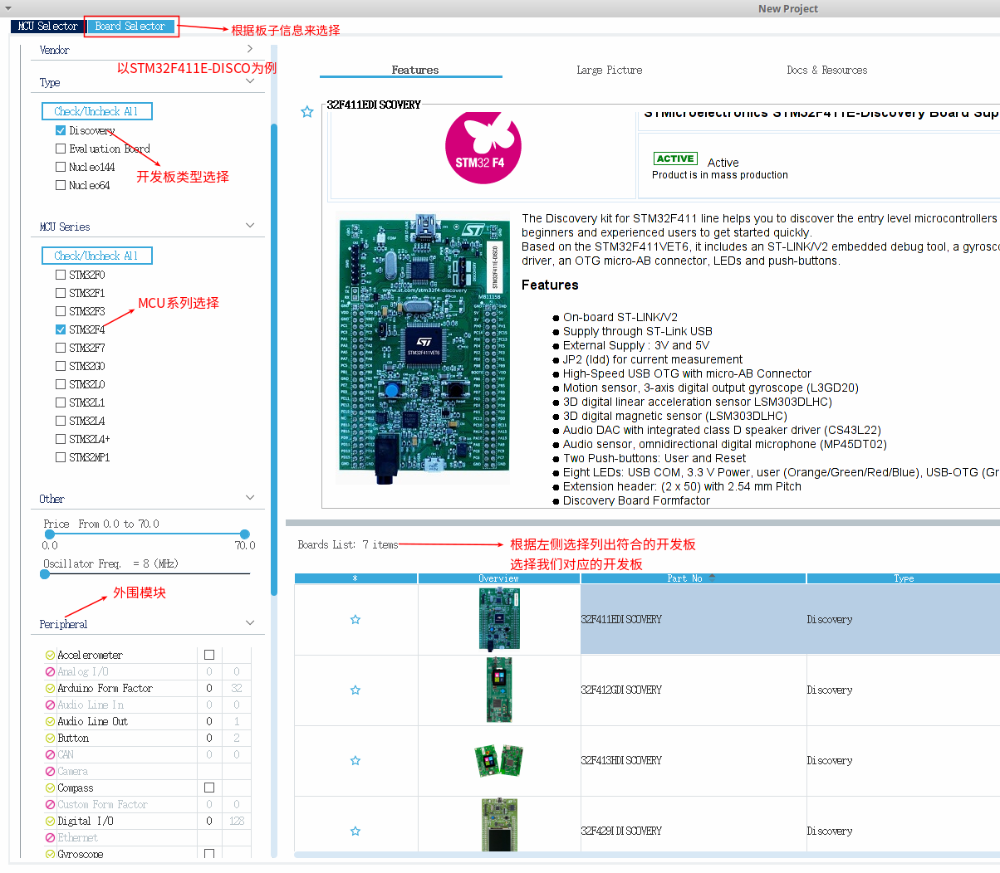
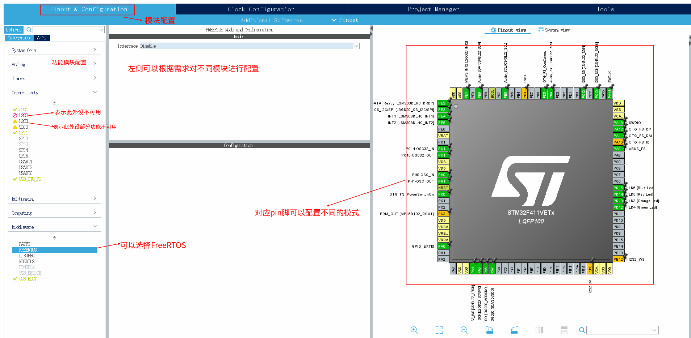
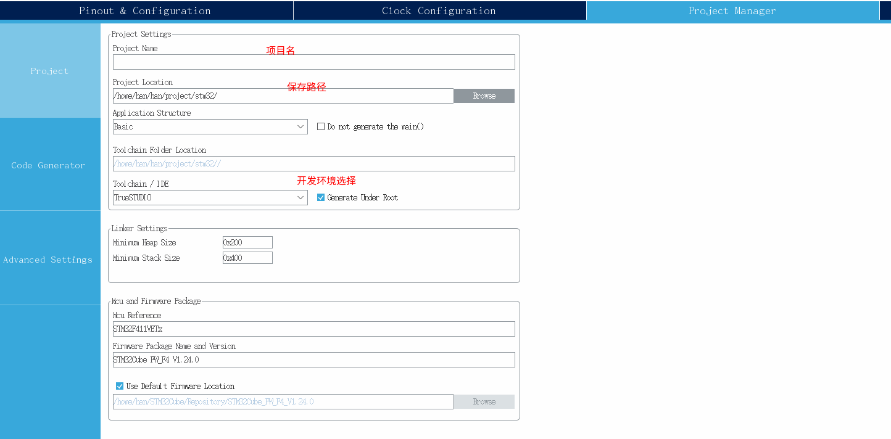
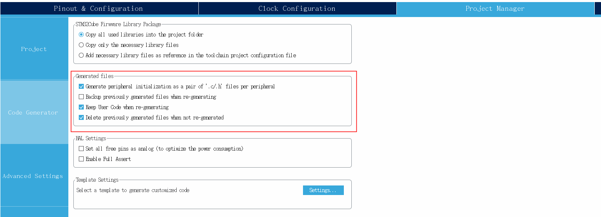
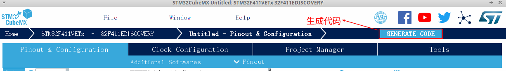

# 工具安装

## STM32CubeProgrammer

* 软件用途

  * 固件升级及烧写

* 安装

  * [软件包](https://my.st.com/b/content/my_st_com/zh/products/development-tools/software-development-tools/stm32-software-development-tools/stm32-programmers/stm32cubeprog.license=1553478990792.product=STM32CubeProg.version=2.0.0.html)

  * 打开软件的时候需要提示需要安装openjfx,则使用一下命令进行安装

    ```shell
    sudo apt-get install openjfx
    ```


## STM32CubeMX

* 软件用途
  * 根据芯片型号选择及模块设置获取代码
* 软件安装
  * [软件包](https://www.st.com/content/st_com/en/products/development-tools/software-development-tools/stm32-software-development-tools/stm32-configurators-and-code-generators/stm32cubemx.html)


## TrueSTUDIO

* 软件用途

  * 软件开发IDE

* 安装

  * [软件包](https://atollic.com/resources/download/linux/linux-archive/?submissionGuid=f623b054-323a-4761-a08b-84a31b5b7adf)

  * 安装说明:

    * 解压

      ```shell
      tar -xvf xxx.tar.gz
      ```

    * 安装

      ```shell
      cd Atollic_TrueSTUDIO_for_STM32_9.3.0_installer && sudo ./install.sh
      ```

      


# 工具使用

## STM32CubeMX

* 新建项目

  

* 功能模块配置

  

* 项目配置

  

  

* 生成代码

  


# 链接

- [**目录**](directory.md)
- [**上一节**]()
- [**下一节**]()

